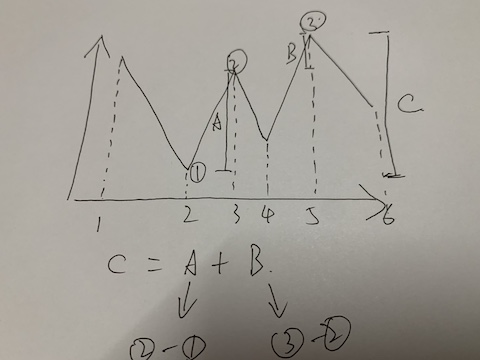

### [122. 买卖股票的最佳时机 II](https://leetcode-cn.com/problems/best-time-to-buy-and-sell-stock-ii/)

#### 题目

 给定一个数组，它的第 i 个元素是一支给定股票第 i 天的价格。

 设计一个算法来计算你所能获取的最大利润。你可以尽可能地完成更多的交易（多次买卖一支股票）。

 注意：你不能同时参与多笔交易（你必须在再次购买前出售掉之前的股票）。

 示例 1:

 输入: [7,1,5,3,6,4]
 输出: 7
 解释: 

在第 2 天（股票价格 = 1）的时候买入，在第 3 天（股票价格 = 5）的时候卖出, 这笔交易所能获得利润 = 5-1 = 4 。
 随后，在第 4 天（股票价格 = 3）的时候买入，在第 5 天（股票价格 = 6）的时候卖出, 这笔交易所能获得利润 = 6-3 = 3 。

 示例 2:
 输入: [1,2,3,4,5]
 输出: 4
 解释: 

在第 1 天（股票价格 = 1）的时候买入，在第 5 天 （股票价格 = 5）的时候卖出, 这笔交易所能获得利润 = 5-1 = 4 。
注意你不能在第 1 天和第 2 天接连购买股票，之后再将它们卖出。
 因为这样属于同时参与了多笔交易，你必须在再次购买前出售掉之前的股票。

 示例 3:
 输入: [7,6,4,3,1]
 输出: 0
 解释: 

在这种情况下, 没有交易完成, 所以最大利润为 0。

#### 思路

将数组绘制成折线图，



分析可知，只要遍历数组，如果后者大于前者，把其差值算入到利润中，最后的结果就是要找的值

#### 复杂度

时间复杂度：O(n)

空间复杂度：O(1)

#### 解法

```swift
class Solution {            
    func maxProfit(_ prices: [Int]) -> Int {
        var maxProfix = 0        
        var index = 1
        while index < prices.count {
            if prices[index] > prices[index - 1] {
                maxProfix += prices[index] - prices[index-1]
            }
            index += 1
        }        
        return maxProfix
    }
}

let test = Solution()
print(test.maxProfit([7,1,5,3,6,4]))
```

